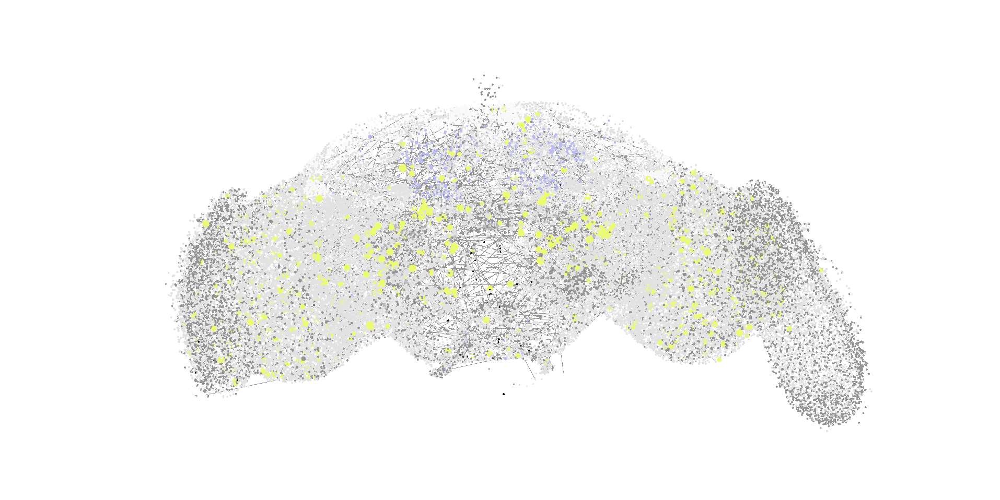

## neurilium
Simple and fast code to simulate small brains.

## quick start
How to simulate fruit fly brain using this tool:  
Go to [CodexFlyWireDownload](https://codex.flywire.ai/api/download?dataset=fafb)  
You would probably need to signin to download the data
Download `Neurotransmitter Type Predictions`, `Connections (Filtered)` and `Marked Neuron Coordinates`  
Extract those 3 csv files and they should be named `neurons.csv`, `connections_princeton.csv` and `coordiantes.csv`  
Clone this repo and inside made a `data/` folder   
Place 3 csv files into `data/` folder  
Then just run `cargo run`  

## controls
`right mouse click/hold` + `wasd` to pan and move  
`q and e` to go down and up 

## architecture
Code is really simple:

`loader.rs` - loads neurons and connections  
`renderer.rs` - setups wgpu and renders neurons  
`shader.wgsl` - shader used to display neurons  
`camera.rs` - controls camera  
`simulation.rs` - manages neuron data for compute shader  
`compute.wgsl` - simulates neurons   
`main.rs` - glues everything together  

Simple, easy to thinker, that is the point. 

## why?
Why Izhikevich neuron model?  
Izhikevich neurons are both computationally simple and they produce great neuron behavior.  

Why use rust and wgpu?  
Because they raplace C++, CUDA, Vulkan stack in increadibly better and unified way.  

Why fruifly brian for example?  
Because it is currently most complex full brain we mapped.  

Why not use AI to simulate brain?  
Because AI and neuromorphic computing works fundamentally different.  

## other brains
Try thinkering the code to simulate other brains.  
Here are some ideas what other brain to simulate:  
[H01](https://h01-release.storage.googleapis.com/landing.html) - small area of human brain reconstruction  
[MICrONS](https://www.microns-explorer.org/) - small area of mouse brain reconstruction  
[Hildebrand17](https://www.lee.hms.harvard.edu/hildebrand-et-al-2017) - zebrafish whole brain reconstruction   
[WormWiring](https://wormwiring.org/) - worm whole nervous system reconstruction  
Those links don't point to datasets, but with a bit of effort you will find them.   
Good luck!  

## acknowledgements
Thanks to the team from [FlyWire](https://flywire.ai/) and [CodexFlyWire](https://codex.flywire.ai/) for having datasets of fruifly brain availbale to everyone. 
Their effort makes brain simulation possible! 
